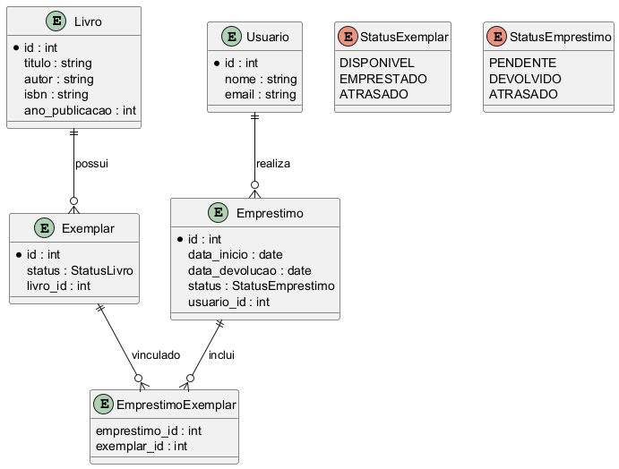

# Sistema de Biblioteca Digital - Desafio de Modelagem

Este projeto foi desenvolvido como parte de um estudo prático de Python, com foco em boas práticas de código, modelagem de dados e uso do SQLAlchemy.
A aplicação simula um sistema de gerenciamento de biblioteca, permitindo o cadastro de livros, usuários e empréstimos.

## 1. Contexto
Você precisa modelar um sistema para gerenciar uma biblioteca digital de livros e usuários.  
O foco é **modelagem de classes e regras de negócio**, sem interface gráfica.

---

## 2. Requisitos Funcionais (RF)

1. **RF01**: Deve ser possível cadastrar livros com título, autor, ISBN e ano de publicação.  
2. **RF02**: Cada livro pode ter múltiplas cópias (exemplares) identificadas por um código único.  
3. **RF03**: Deve ser possível cadastrar usuários com nome, email e tipo (`Estudante` ou `Professor`).  
4. **RF04**: Usuários podem emprestar livros, mas há limites:  
   - Estudantes: máximo 3 livros simultâneos  
   - Professores: máximo 5 livros simultâneos  
5. **RF05**: Cada empréstimo possui data de início e prazo de devolução (dias diferentes para estudante/professor).  
6. **RF06**: Deve ser possível listar livros disponíveis, emprestados e atrasados.  
7. **RF07**: Deve haver registro de histórico de empréstimos por usuário e por livro.  

---

## 3. Regras de Negócio (RN)

- **RN01**: Um mesmo exemplar não pode ser emprestado para mais de um usuário ao mesmo tempo.  
- **RN02**: Quando um livro é devolvido, ele se torna disponível novamente.  
- **RN03**: Empréstimos atrasados devem ser identificados automaticamente com base na data atual.  
- **RN04**: Usuários têm um limite de empréstimos simultâneos conforme seu tipo.  
- **RN05**: O sistema deve gerar IDs únicos para usuários, livros e exemplares automaticamente.  
- **RN06**: É obrigatório manter um registro histórico completo de todos os empréstimos, mesmo após devolução.  
- **RN07**: Ao cadastrar um livro, é possível cadastrar **múltiplos exemplares** de uma vez.  
- **RN08**: Examplares só podem ser removidos se estiverem disponíveis para empréstimo.

---

## 4. Observações para Modelagem

- O sistema deve permitir **consultas e relatórios** de disponibilidade e histórico.  
- Alguns atributos podem ser derivados, como `atrasado` em `Emprestimo`.  

---

## 5. Modelo Entidade Relacional (MER)



## 6. Esturutra do Projeto


```bash
sistema-biblioteca/
│
├── src/
│   ├── models.py         # Modelos de domínio e classes ORM
│   ├── services.py       # Serviços de que gerenciam as entidades e o banco de dados
│   ├── main.py           # Ponto de entrada da aplicação
│   ├── utils.py          # Utilitários
│
├── tests/
│   ├── conftest.py       # Implementação de fixtures
│   ├── test_models.py    # Testes unitários das classes
│
├── requirements.txt      # Dependências do sistema
└── README.md             # Documentação
```